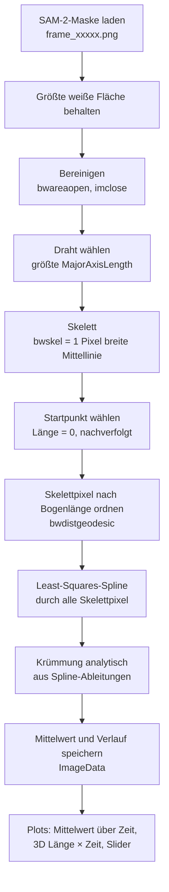

# Krümmungsauswertung `kruemung_jinhan_v2_luca.m`

Diese Datei beschreibt, wie `kruemung_jinhan_v2_luca.m` aus den
Schwarz/Weiß-Masken eines Drahtvideos die Krümmungswerte und Plots erzeugt.

---

## 1. Überblick

Das Skript bestimmt für jeden Frame eines `.avi`-Videos die **Krümmung eines
Drahts entlang seiner Länge** und stellt sie über der Zeit dar.

Es gibt zwei Schritte:

1. **Segmentierung (Python, einmal pro Video):** `segment_wire_sam2.py`
   segmentiert den Draht mit SAM 2 und speichert pro Frame eine
   Schwarz/Weiß-Maske als `<videoname>_sam2_masks\frame_00001.png`, … neben
   dem Video. Weiß bedeutet Draht, schwarz Hintergrund. Einrichtung: siehe
   `README_SAM2.md`.
2. **Auswertung (MATLAB):** `kruemung_jinhan_v2_luca.m` lädt diese Masken und
   berechnet daraus die Krümmung.

### Ablauf pro Frame



---

## 2. Parameter (oben im Skript)

| Parameter | Standard | Bedeutung |
|---|---|---|
| `pxPerMm` | `1` | Kalibrierung des Videos [px/mm]. **Muss eingetragen werden**, sonst sind die Werte in 1/px statt 1/mm. Messen z. B. mit `imdistline` an einer bekannten Länge im Frame. |
| `kappaInlay` | `0.4252` | Mittlere Krümmung des Inlays [1/mm], exakt aus der Geometrie (`inlayGeometry_v2.m`). Wird nur als Referenzlinie geplottet. |
| `knotSpacing` | `40` | Knotenabstand der Spline [px]. Größer heißt glatter, kleiner heißt detailreicher, aber verrauschter. |
| `nParamIter` | `3` | Anzahl der Fußpunkt-Iterationen beim Spline-Fit (Abschnitt 3.7). `0` ordnet die Pixel nur über die Bogenlänge zu. |
| `Neval` | `200` | Anzahl der Auswertepunkte entlang der Spline je Frame. |

Diese Werte stehen fest im Code: `bwareaopen(…, 300)`, `gapCloseRadius = 1`
und `bwskel(…, 'MinBranchLength', 25)`.

---

## 3. Von der Maske zur Krümmung (pro Frame)

### 3.1 Vorbereitung (vor der Schleife)

- Ein Dialog fragt, welches `.avi` ausgewertet werden soll.
- Das Skript prüft, ob der Ordner `<videoname>_sam2_masks` existiert und ob die
  Anzahl der Masken genau der Anzahl der Frames entspricht. Andernfalls bricht
  es mit einem `error` ab, damit keine Maske dem falschen Frame zugeordnet wird.
- Der Zeitvektor ist `tVec = (0:N-1)/frameRate` in Sekunden.
- Der Dialog **„Maskenkontrolle“** fragt, ob die Maske jedes Frames angezeigt
  werden soll. Standard ist „Nicht anzeigen“, das ist schneller.

### 3.2 Maske laden

```matlab
tubeFG = imread(maskFile) > 0;   % true = Draht
```

Nur die **größte zusammenhängende weiße Fläche** bleibt erhalten. Kleine
Fehlsegmentierungen fallen damit weg. Wenn im Dialog „Anzeigen“ gewählt wurde,
erscheint diese Maske in `figure(1)`.

### 3.3 Bereinigen und Draht auswählen

- `bwareaopen(tubeFG, 300)` entfernt Flächen mit weniger als 300 Pixeln.
- `imclose(…, strel('disk', 1))` schließt kleine Lücken im Draht.
- Bleiben mehrere Flächen übrig, wird die mit der **größten Hauptachsenlänge**
  (`MajorAxisLength`) als Draht gewählt, also die am stärksten langgestreckte.
  Das ist robuster als die größte Fläche, weil z. B. runde Luftblasen viel
  Fläche haben können, aber kurz sind.

### 3.4 Skelettieren

```matlab
skel = bwskel(tubeMain, 'MinBranchLength', 25);
```

Das Skelett ist die **Mittellinie** des Drahts, ein Pixel breit. Kurze
Seitenäste unter 25 px werden entfernt. Am Ende der Linie ist das Skelett etwa
um die halbe Drahtbreite kürzer als der Draht selbst.

### 3.5 Startpunkt (Länge = 0) festlegen

Die Endpunkte des Skeletts liefert `bwmorph(skel, 'endpoints')`. Als
Startpunkt wählt das Skript:

- **im ersten verwertbaren Frame** den Endpunkt mit dem kleinsten Abstand zum
  Bildrand. Das wird als eingespanntes Ende angenommen.
- **in jedem weiteren Frame** den Endpunkt, der dem Startpunkt des vorherigen
  Frames am nächsten liegt (`prevStart`).

So zeigt „Länge = 0“ über das ganze Video auf dieselbe Stelle am Draht. Das ist
für den 3D-Plot wichtig.

### 3.6 Skelettpixel nach Bogenlänge ordnen

```matlab
D = bwdistgeodesic(skel, x0, y0, 'quasi-euclidean');
```

Für jedes Skelettpixel wird der Weg **entlang des Skeletts** vom Startpunkt
berechnet, die geodätische Distanz $d$ in px. Damit sind alle Pixel entlang
des Drahts geordnet. Unerreichbare Pixel (`Inf`) und doppelte Distanzen
(`unique`) werden entfernt.

Das Ergebnis ist eine geordnete Punktfolge $(d_i,\, x_i,\, y_i)$, also **alle**
Skelettpixel mit ihrer Position entlang des Drahts.

### 3.7 Least-Squares-Spline durch alle Skelettpixel (`fitSplineLSQ`)

**Problem:** Die Skelettpixel liegen auf einem ganzzahligen Pixelraster. Ein
glatter Bogen wird dadurch zu einer Treppe. Leitet man die Pixelpunkte direkt
numerisch zweimal ab, misst man die Treppe und nicht den Draht. Die Krümmung
ist dann reines Rauschen, im Test etwa 45-mal zu groß.

**Lösung:** Durch die Pixel wird eine glatte, parametrische, kubische Spline
gelegt:

$$
S(t) = \begin{pmatrix} S_x(t) \\ S_y(t) \end{pmatrix}, \qquad t = \text{Bogenlänge in px}
$$

- **Knoten:** gleichmäßig im Abstand `knotSpacing` über die Drahtlänge,
  mindestens 4 Knoten. Zwischen zwei Knoten ist die Spline ein kubisches
  Polynom. Die Spline hat damit **deutlich weniger Freiheitsgrade als es Pixel
  gibt**. Sie kann der Form des Drahts folgen, aber nicht jeder Treppenstufe.
- **Fit:** Die Spline-Koeffizienten $c$ werden so bestimmt, dass der quadratische
  Abstand aller Pixel zur Spline minimal ist:

  $$
  \min_{c}\ \sum_i \bigl\lVert P_i - S(t_i) \bigr\rVert^2
  $$

  Das ist ein **lineares** Least-Squares-Problem. Die Basismatrix $B$ entsteht
  aus `spline(knots, eye(nKnots))`: Spalte $j$ ist die kubische Spline, die im
  Knoten $j$ den Wert 1 und in allen anderen Knoten den Wert 0 hat. Damit gilt
  $S_x(t) = B(t)\,c_x$ und die Lösung ist `cx = B \ x`, für $y$ genauso. Dafür
  ist keine Toolbox nötig.
- **Fußpunkt-Korrektur (`nParamIter` = 3):** Nach jedem Fit wird der Parameter
  $t_i$ jedes Pixels auf den **nächstgelegenen Punkt der Spline** verschoben
  (ein Gauss-Newton-Schritt), danach wird neu gefittet. Dadurch wird der echte
  **senkrechte Abstand** der Pixel zur Kurve minimiert und nicht nur der
  Abstand bei fester Bogenlänge:

  $$
  t_i \leftarrow t_i + \frac{(P_i - S(t_i)) \cdot S'(t_i)}{\lVert S'(t_i) \rVert^2}
  $$

- **Kontrollwert `fitRMS`:** der mittlere Abstand der Pixel zur Spline in px.
  Etwa 0,3–0,4 px ist normal, das ist das Rauschen durch das Pixelraster.
  Deutlich über 0,5 px heißt, die Spline ist zu steif (`knotSpacing`
  verkleinern). Deutlich darunter heißt, sie folgt der Treppe (`knotSpacing`
  vergrößern).

### 3.8 Krümmung analytisch berechnen (`splineCurvature`)

Die Spline ist stückweise ein Polynom. Ihre Ableitungen werden deshalb **exakt**
gebildet (`ppDeriv`: Polynomkoeffizienten ableiten) und nicht numerisch
geschätzt. An `Neval = 200` gleichmäßig verteilten Stellen $s$ entlang des
Drahts gilt:

$$
\kappa(s) = \frac{\lvert x'(s)\, y''(s) - y'(s)\, x''(s) \rvert}{\bigl(x'(s)^2 + y'(s)^2\bigr)^{3/2}}
\qquad [1/\text{px}]
$$

- $\kappa = 1/R$, wobei $R$ der Radius des Kreises ist, der den Draht an dieser
  Stelle am besten annähert. Eine Gerade hat $\kappa = 0$.
- Es wird der **Betrag** genommen, die Biegerichtung (links/rechts) geht also
  nicht ein.
- Die **mittlere Krümmung** des Frames ist der Mittelwert über die 200 Punkte.
  Weil die Punkte gleichmäßig entlang der Länge verteilt sind, ist das der
  Mittelwert über die Bogenlänge.

### 3.9 Gespeicherte Daten (`ImageData(n)`)

| Feld | Inhalt |
|---|---|
| `rgb` | Originalbild des Frames |
| `bw` | bereinigte Maske |
| `skel` | Skelett |
| `xs`, `ys` | Spline-Punkte (200) in Bildkoordinaten [px] |
| `s` | Bogenlänge dieser Punkte ab dem Startpunkt [px] |
| `kappa` | Krümmung an diesen Punkten [1/px] |
| `mean_kappa` | mittlere Krümmung des Frames [1/px] |
| `fitRMS` | RMS-Abstand Skelettpixel ↔ Spline [px] |

Ist ein Frame nicht auswertbar (keine Fläche, kein Skelett, weniger als 4
Skelettpunkte), werden die Werte mit `NaN` gefüllt und es erscheint eine
`warning`. Das Skript läuft dann weiter.

---

## 4. Plots und Ausgaben

Intern rechnet das Skript in Pixeln. Erst für die Plots wird umgerechnet:

$$
\kappa_{\text{mm}} = \kappa_{\text{px}} \cdot \texttt{pxPerMm},
\qquad s_{\text{mm}} = s_{\text{px}} / \texttt{pxPerMm}
$$

### `figure(1)`: Maskenkontrolle (optional)

Die Schwarz/Weiß-Maske jedes Frames während der Auswertung. Sie erscheint nur,
wenn im Dialog „Anzeigen“ gewählt wurde.

### `figure(2)`: Mittlere Krümmung über der Zeit

- Die Kurve zeigt `mean_kappa` jedes Frames in **1/mm** über der Zeit in s.
- Die gestrichelte Linie **„Inlay (Ziel)“** liegt bei `kappaInlay`, der
  mittleren Krümmung der Inlay-Form. Erreicht die Kurve diese Linie, ist der
  Draht im Mittel so stark gekrümmt wie das Inlay.

### `figure(3)`: Krümmung über Länge und Zeit (3D)

- Achsen: Zeit [s], Länge ab Startpunkt [mm] und Krümmung [1/mm]. Die
  Krümmung ist zusätzlich farbcodiert.
- Alle Frames werden per `interp1` auf eine **gemeinsame Längsachse** von 0 bis
  zur größten gemessenen Länge gelegt. Ist der Draht in einem Frame kürzer,
  bleibt dahinter eine Lücke (`NaN`).
- Der Plot ist mit der Maus drehbar. Mit `view(2)` siehst du ihn von oben als
  Heatmap. Darin erkennt man gut, **wo** und **wann** sich der Draht biegt.

### Fenster „Krümmungsdarstellung“: Slider

Das Originalbild jedes Frames, darüber die Spline als farbige Linie (jet,
blau = schwach, rot = stark gekrümmt). Mit dem Slider blätterst du durch die
Frames. Die Farbskala reicht von der kleinsten bis zur größten Krümmung im
ganzen Video.

### Konsolenausgabe

- größte und letzte mittlere Krümmung in 1/mm, jeweils mit Radius in mm
- die Inlay-Referenz
- der mittlere und der größte `fitRMS` über alle Frames
- eine Warnung, solange `pxPerMm = 1` gesetzt ist

---

## 5. Referenz: `inlayGeometry_v2.m`

`inlayGeometry_v2.m` erzeugt die Inlay-Geometrie: eine gerade Einlaufstrecke
und sechs Kreisbögen. Es berechnet daraus

- die **exakte** mittlere Krümmung (Gerade $\kappa = 0$, Bogen $\kappa = 1/r$,
  gewichtet mit der Bogenlänge): **0,4252 1/mm**, also ein mittlerer Radius von
  ≈ 2,35 mm. Dieser Wert steht als `kappaInlay` im Auswerteskript.
- zum Vergleich die Krümmung mit **derselben Spline-Methode**. Daran sieht man,
  wie genau die Methode bei dem gewählten Maßstab und `knotSpacing` ist.

Die Hilfsfunktionen `fitSplineLSQ`, `splineCurvature` und `ppDeriv` sind dort
als Kopie enthalten. Wer sie oder `knotSpacing` ändert, muss das in **beiden**
Dateien tun.

---

## 6. Genauigkeit und Grenzen

- **Test** an künstlich auf Pixel gerundeten Kreisen und Spiralen mit
  Radius 80–330 px und `knotSpacing = 40`:
  - mittlere Krümmung: etwa **2 %** Fehler
  - lokale Krümmung in der Drahtmitte: etwa **7 %**
  - Inlay bei 30 px/mm: Spline 0,4346 gegenüber exakt 0,4252 1/mm
- **Drahtenden:** Dort ist die lokale Krümmung ungenauer, weil die Spline nur
  auf einer Seite Punkte hat. Ausreißer am Anfang oder Ende der Längsachse im
  3D-Plot sind meist ein Messfehler.
- **`knotSpacing`** ist der Regler zwischen Glätten und Detail. Ohne diese
  Begrenzung, also mit einer Spline durch jedes Pixel, kommt das
  Pixelrauschen vollständig zurück. Wählen über `fitRMS` (Abschnitt 3.7).
- **2D-Projektion:** Die Kamera sieht nur die Bildebene. Biegt sich der Draht
  aus dieser Ebene heraus, wird die Krümmung unterschätzt.
- **Startpunkt:** Das Skript nimmt an, dass im ersten Frame das eingespannte
  Ende dem Bildrand am nächsten liegt und dass sich das Ende von Frame zu Frame
  nur wenig bewegt. Das sollte man bei einem neuen Versuchsaufbau einmal prüfen.
- **Maßstab:** Absolute Werte in mm und 1/mm stimmen nur mit einem korrekt
  eingetragenen `pxPerMm` für genau diese Kameraeinstellung.
